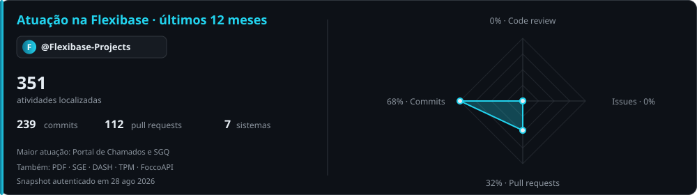
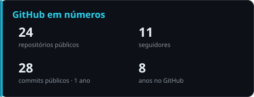
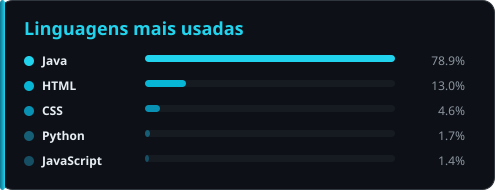
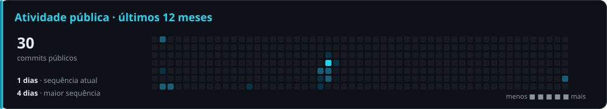

<!-- Perfil de Ícaro França | cards em /assets gerados por scripts/generate_profile_cards.py -->

<div align="center">


<a href="https://github.com/IcaroFranca">
  
</a>

<br />

<a href="https://github.com/Flexibase-Projects">
  
</a>


</div>

## 👨‍💻 Sobre mim

```typescript
const icaro = {
  papel: "Desenvolvedor Full Stack",
  empresa: "@Flexibase-Projects",
  local: "Goiânia, Goiás 🇧🇷",
  trabalho: [
    "Sistemas corporativos que organizam operação, qualidade e atendimento",
    "Aplicações completas: interface, API, dados, autenticação e deploy",
    "Integrações entre o ecossistema Flexibase e sistemas internos",
  ],
  valores: ["Código claro", "Produto útil", "Evolução contínua"],
  objetivo: "Transformar processos reais em software confiável",
};
```

Trabalho na **Flexibase**, onde concentro a maior parte da minha experiência prática: desenho fluxos, desenvolvo aplicações de ponta a ponta, integro sistemas e acompanho cada entrega até produção.

## 🏢 Minha atuação na Flexibase

<div align="center">



</div>

> A maior parte dos repositórios corporativos é privada. Os destaques abaixo descrevem o impacto e a arquitetura em nível de portfólio, sem expor informações sensíveis.

<table>
<tr>
<td width="50%" valign="top">

### 🧭 SGQ — Sistema de Gestão da Qualidade
**Qualidade, manutenção e melhoria contínua em uma só plataforma**

Sistema corporativo para digitalizar fluxos de qualidade: ocorrências e não conformidades, manutenções de clientes, controle documental, certificações, processos, POPs, auditoria e kanbans operacionais.

- SSO corporativo e RBAC validado na API
- Integração controlada com o ERP Focco
- Timelines, auditoria, documentos e automações de fluxo
- CI obrigatória e deploy blue-green

`React 19` `TypeScript` `Node.js` `Express` `SQLite` `Vite`

</td>
<td width="50%" valign="top">

### 🎫 Portal de Chamados
**Atendimento interno organizado por departamento**

Plataforma completa para abertura, acompanhamento e gestão de tickets, com formulários dinâmicos, dashboards, respostas, templates e permissões granulares por área.

- Dashboard com indicadores e gráficos operacionais
- Editor drag-and-drop de templates
- SSO Flexibase e permissões por departamento
- Supabase/PostgreSQL e deploy em containers

`React` `TypeScript` `Node.js` `Express` `Supabase` `Docker`

</td>
</tr>
<tr>
<td colspan="2" valign="top">

### 🔗 Ecossistema Flexibase
**Sistemas especializados que compartilham identidade, dados e infraestrutura**

Também contribuí em soluções como **PDF**, **SGE**, **DASH**, **TPM** e **FoccoAPI** — aplicações corporativas, dashboards, APIs internas e integrações que conectam diferentes áreas da empresa com uma experiência consistente.

`React` `TypeScript` `APIs REST` `SSO / OIDC` `GitHub Actions` `Docker` `Blue-green deploy`

</td>
</tr>
</table>

## 🛠️ Tecnologias

<div align="center">


</div>

## 📊 GitHub em números

<div align="center">




<br />



</div>

> Estes três cards usam os repositórios públicos pessoais. A atividade corporativa privada aparece separadamente no card da Flexibase e no gráfico nativo de contribuições do GitHub quando a visibilidade está habilitada.

## 🚀 Projeto pessoal em destaque

<table>
<tr>
<td width="65%" valign="top">

### ⚔️ [NexusRPG](https://github.com/IcaroFranca/PluginRPGMinecraft)
**Plugin modular de RPG para Paper/Spigot**

Sistema completo para transformar servidores Minecraft em uma experiência RPG: árvore de habilidades, combate, bestiário, economia, mineração, loja, status e suporte a múltiplos idiomas.

- Arquitetura dividida por módulos de domínio
- Árvore de combate com 19 habilidades e progressão por tiers
- Build e validações automatizadas no GitHub Actions

`Java` `Maven` `Paper API` `Spigot` `CI`

</td>
<td width="35%" valign="top">

### 🌱 Jornada pública

Meus repositórios pessoais registram a evolução desde HTML e CSS até aplicações React, integrações com APIs e sistemas Java.

- [React Commerce](https://github.com/IcaroFranca/ProjetoReactCommerce)
- [Busca CEP](https://github.com/IcaroFranca/ProjetoBuscaCEP)
- [Icarus Recipes](https://icarofranca.github.io/ProjetoReceitas)

</td>
</tr>
</table>

## 🤝 Vamos conectar

<div align="center">

<a href="https://www.linkedin.com/in/icaroferreirafranca">
  
</a>
<a href="https://github.com/Flexibase-Projects">
  
</a>
<a href="https://github.com/IcaroFranca">
  
</a>

</div>

<div align="center">


<i>Software que nasce de problemas reais e chega até produção.</i>

</div>
