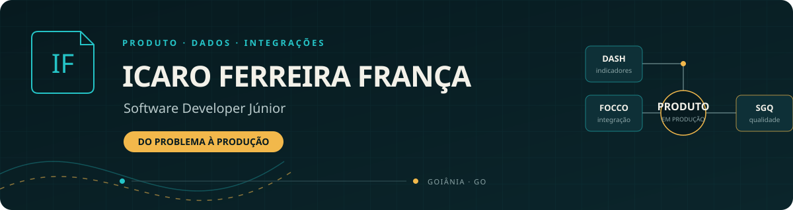
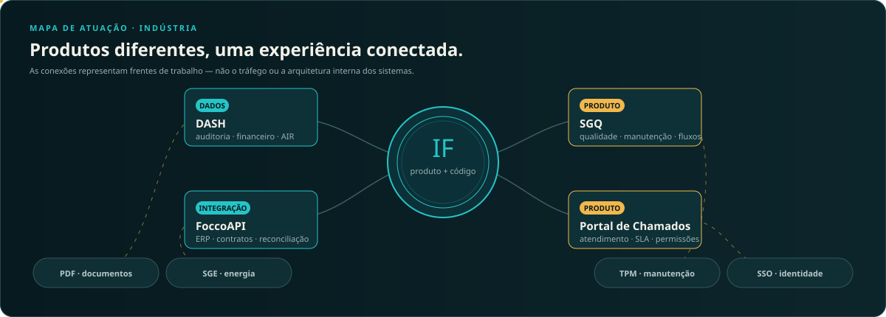

 

Desenvolvedor júnior com experiência prática em **produtos internos, dashboards, integrações e software em produção**.

[LinkedIn](https://www.linkedin.com/in/icaroferreirafranca) · [Projetos pessoais](#projetos-pessoais) · [Atuação na Flexibase](#produtos-e-integrações-na-flexibase)

---

## Minha trajetória, em contexto

Não comecei por uma stack pronta. Comecei entendendo a base e fui adicionando camadas: páginas estáticas, JavaScript, consumo de APIs, componentes React, sistemas Java e, depois, produtos corporativos conectados a dados reais.

| Etapa | O que construí | O que levei para a próxima fase |
|---|---|---|
| **Fundamentos web** | Currículo HTML, páginas de conteúdo e o Icarus Recipes | Semântica, CSS, responsividade e publicação |
| **Aplicações e APIs** | Busca CEP e React Commerce | Componentização, estados de interface, TypeScript e integração REST |
| **Arquitetura em Java** | NexusRPG para Paper/Spigot | Domínios, módulos, regras de negócio, Maven e integração contínua |
| **Software em produção** | Produtos e integrações da Flexibase | Autenticação, dados, auditoria, CI/CD, deploy e evolução orientada pela operação |

Hoje conduzo minha evolução profissional conectando **interface, regra de negócio, dados e entrega**. Meu grau de senioridade é júnior; minha responsabilidade, porém, já inclui acompanhar problemas do entendimento até a produção.

### Formação que sustenta essa evolução

- **Tecnologia em Big Data e Inteligência Artificial** — PUC Goiás, 2023–2025, conclusão *magna cum laude*.
- Formação complementar em **Git, SQL, lógica de programação e Java orientado a objetos**.
- **Inglês avançado** para leitura técnica e comunicação profissional.

## Produtos e integrações na Flexibase

> Os repositórios corporativos são privados. As descrições abaixo apresentam minha participação e o contexto técnico sem expor código, credenciais, dados ou regras sensíveis da empresa.

### DASH — indicadores que podem ser investigados

O DASH é uma plataforma de dashboards variáveis. Minha contribuição foi especialmente forte na experiência financeira e na transformação de números isolados em indicadores que podem ser conferidos, explicados e acompanhados.

**Onde atuei**

- Evolução do **Modo Auditoria** em cards, gráficos, tabelas e detalhamentos.
- Fluxos de certificação com permissões, evidências, comentários, pendências e histórico.
- Regras e alertas para apoiar a leitura de riscos financeiros.
- Construção e evolução de visões como DRE, balanço patrimonial e indicadores no AIR.
- Integração dos dashboards com dados reais do ERP por meio da FoccoAPI, mantendo credenciais fora do cliente e contratos de consulta controlados.
- Testes de reconciliação para diferenciar erro visual, regra de indicador e divergência na fonte.

`React 19` `TypeScript` `Vite` `Supabase` `Auditoria` `Dados financeiros`

### FoccoAPI — o ERP como fonte, sem acoplamento direto

Minha principal contribuição relacionada à FoccoAPI está no **uso da API como camada de integração**. Em vez de colocar regras e consultas ao ERP dentro de cada tela, trabalhei com contratos read-only que permitem ao DASH e ao SGQ consumir dados corporativos de maneira mais segura e previsível.

**Na prática, isso envolveu**

- Consumo de endpoints financeiros e operacionais com filtros explícitos.
- Integração via proxy seguro, sem expor chaves ou o banco Oracle ao navegador.
- Separação entre a apresentação do indicador, sua regra de cálculo e sua fonte de referência.
- Reconciliação de períodos e totais antes de tratar um dado como confiável no dashboard.
- Uso da integração em cenários de clientes, pedidos, itens, histórico e análises financeiras.
- Validação do comportamento sem substituir silenciosamente dados reais por valores simulados.

`TypeScript` `REST` `Oracle` `Read-only` `Contratos` `Integração ERP`

### SGQ — qualidade e manutenção em um fluxo contínuo

No Sistema de Gestão da Qualidade, participei de uma evolução ampla do produto. O sistema reúne ocorrências, não conformidades, manutenções de clientes, controle documental, certificações, processos, POPs, auditorias e painéis operacionais.

**Minhas frentes de contribuição**

- Fluxos de triagem, atribuição, tratamento, evidências e verificação de eficácia.
- Kanbans, timelines, indicadores, automações e registros de auditoria.
- Perfis e permissões integrados ao SSO corporativo, com validação também na API.
- Integrações com dados do Focco para evitar cadastros duplicados e dar contexto à operação.
- Estabilidade, testes, documentação e preparação de entregas para produção.

`React 19` `TypeScript` `Node.js` `Express` `SQLite` `SSO` `RBAC`

### Portal de Chamados — atendimento configurável por área

Participei da construção e evolução de uma plataforma interna de atendimento, criada para substituir fluxos fragmentados por solicitações rastreáveis e configuráveis por departamento.

**Minhas frentes de contribuição**

- Templates de chamados com campos condicionais e edição visual.
- Dashboards, filtros, respostas, timeline, SLA e experiência administrativa.
- Gestão de usuários e permissões granulares por departamento.
- Integração ao SSO Flexibase e persistência no Supabase/PostgreSQL.
- Responsividade, padronização visual e publicação em containers.

`React` `TypeScript` `Node.js` `Express` `Supabase` `Docker`

<strong>Outras participações no ecossistema</strong>

 

| Sistema | Contexto da minha participação |
|---|---|
| **PDF** | Integração ao SSO, preparação para deploy blue-green, documentação de produção e alinhamento de interface |
| **SGE** | Pipeline de publicação, preparação para produção e correções relacionadas ao ambiente Supabase |
| **TPM** | Evolução do painel de solicitações de manutenção e apoio ao processo de publicação |
| **CDT** | Correções de estabilidade no frontend e em fluxos de conclusão de tarefas |
| **SSO** | Participação em iniciativas de acesso e provisionamento dentro do ecossistema corporativo |
| **MKTMAIL** | Preparação do sistema interno para o padrão de publicação da infraestrutura Flexibase |

## Projetos pessoais

Meus projetos públicos não competem com a experiência corporativa: eles mostram **como cheguei até ela** e onde continuo experimentando com liberdade.

### [NexusRPG](https://github.com/IcaroFranca/PluginRPGMinecraft)

Plugin modular de RPG para servidores Paper/Spigot. É o projeto pessoal em que mais exercitei organização de domínio e regras de negócio.

- Árvore de combate com 19 habilidades e progressão por tiers.
- Sistemas de combate, bestiário, economia, mineração, loja e atributos.
- Suporte a múltiplos idiomas e configuração por módulos.
- Build e validações automatizadas no GitHub Actions.

`Java` `Maven` `Paper API` `Spigot` `CI`

### [React Commerce](https://github.com/IcaroFranca/ProjetoReactCommerce)

Experiência de e-commerce criada para aprofundar componentes reutilizáveis, estados de interface, TypeScript e responsividade.

`React 19` `TypeScript` `Vite` `CSS`

### [Busca CEP](https://github.com/IcaroFranca/ProjetoBuscaCEP)

Aplicação de consulta de endereços que marcou minha evolução no consumo de APIs e na separação entre modelos, serviços e controllers.

`JavaScript` `REST API` `HTML` `CSS`

### [Icarus Recipes](https://icarofranca.github.io/ProjetoReceitas)

Site editorial de receitas publicado no GitHub Pages. Consolidou fundamentos de semântica, composição visual e responsividade.

`HTML` `CSS` `GitHub Pages`

### [Currículo HTML](https://github.com/IcaroFranca/ProjetoCurriculoHTML)

Um currículo semântico, publicável e legível por pessoas e ferramentas de seleção. Foi um dos primeiros passos conscientes da minha presença profissional na web.

`HTML` `Semântica` `SEO` `ATS`

## Tecnologias, pelo papel que cumprem

| Camada | Ferramentas e conhecimentos |
|---|---|
| **Interfaces e produto** | React, TypeScript, JavaScript, Vite, HTML e CSS |
| **APIs e regras de negócio** | Node.js, Express, APIs REST e Java |
| **Dados e integrações** | Supabase, PostgreSQL, SQLite, Oracle e FoccoAPI |
| **Identidade e segurança** | SSO, OIDC, RBAC e contratos read-only |
| **Entrega e operação** | Git, GitHub Actions, Docker, GHCR, testes e deploy blue-green |

## O que procuro desenvolver agora

- Aprofundar arquitetura backend e modelagem de dados.
- Tornar integrações e indicadores cada vez mais observáveis e testáveis.
- Evoluir de executor de tarefas para alguém capaz de compreender o produto inteiro.
- Continuar construindo software útil, com contexto e responsabilidade.

---

### Vamos conversar

Sou **Icaro Ferreira França**, Software Developer Júnior em Goiânia, Goiás.

[LinkedIn](https://www.linkedin.com/in/icaroferreirafranca) · [GitHub](https://github.com/IcaroFranca) · [Flexibase Projects](https://github.com/Flexibase-Projects)

Software que nasce de problemas reais e chega até produção.

