 

Desenvolvedor júnior com experiência prática em **produtos internos, dashboards, integrações e software em produção**.

[LinkedIn](https://www.linkedin.com/in/icaroferreirafranca) · [Projetos pessoais](#-projetos-pessoais) · [Experiência na indústria](#-experiência-na-indústria)

## 🧭 Em poucas linhas

- Formado em **Big Data e Inteligência Artificial** pela PUC Goiás, *magna cum laude*.
- Evoluí de projetos em HTML e JavaScript para aplicações React, sistemas Java e produtos corporativos.
- Na indústria, trabalho conectando interface, APIs, dados, autenticação e entrega.
- Sou júnior e busco crescer compreendendo o produto inteiro, não apenas a tarefa isolada.

## 🧰 Tecnologias por área

## 🏢 Experiência na indústria

> Os repositórios corporativos são privados. Os resumos abaixo preservam código, dados e regras internas.

### 📊 DASH

Atuação forte na experiência financeira: **Modo Auditoria**, certificação de indicadores, evidências, histórico, alertas e visões como DRE e balanço patrimonial. Também trabalhei na integração e reconciliação de dados reais do ERP.

`React 19` `TypeScript` `Supabase` `Auditoria` `Dados financeiros`

### 🔗 FoccoAPI

Usei a API como ponte read-only entre o FoccoERP e produtos como DASH e SGQ. Minha participação se concentrou no **consumo seguro, contratos, filtros e reconciliação**, evitando acesso direto do navegador ao Oracle.

`TypeScript` `REST` `Oracle` `Read-only` `Integração ERP`

### 🧭 SGQ

Contribuí em fluxos de qualidade, não conformidades, manutenção, documentos, auditoria, kanbans e indicadores, além de permissões pelo SSO e integrações com dados do Focco.

`React` `Node.js` `Express` `SQLite` `SSO` `RBAC`

### 🎫 Portal de Chamados

Participei da construção de templates configuráveis, campos condicionais, dashboards, SLA, timeline e permissões por departamento, acompanhando também autenticação e publicação.

`React` `TypeScript` `Supabase` `Docker` `SSO`

<strong>Outras participações no ecossistema</strong>

 

| Sistema | Contexto da minha participação |
|---|---|
| **PDF** | SSO, deploy blue-green, documentação e interface |
| **SGE** | Pipeline de publicação, produção e ambiente Supabase |
| **TPM** | Painel de manutenção e apoio à publicação |
| **CDT** | Estabilidade do frontend e fluxos de tarefas |
| **SSO** | Acesso e provisionamento entre aplicações |
| **MKTMAIL** | Adequação ao padrão de infraestrutura corporativa |

## 🧪 Projetos pessoais

| Projeto | O que representa na minha evolução |
|---|---|
| ⚔️ **[NexusRPG](https://github.com/IcaroFranca/PluginRPGMinecraft)** | Sistema modular em Java com combate, habilidades, economia, internacionalização e CI |
| 🛒 **[React Commerce](https://github.com/IcaroFranca/ProjetoReactCommerce)** | Componentes reutilizáveis, TypeScript, estado e responsividade |
| 📍 **[Busca CEP](https://github.com/IcaroFranca/ProjetoBuscaCEP)** | Consumo de API e separação entre models, services e controllers |
| 🍲 **[Icarus Recipes](https://icarofranca.github.io/ProjetoReceitas)** | Semântica, composição visual, CSS e GitHub Pages |
| 📄 **[Currículo HTML](https://github.com/IcaroFranca/ProjetoCurriculoHTML)** | Primeiro projeto profissional publicável, compatível com leitura ATS |

---

 

[LinkedIn](https://www.linkedin.com/in/icaroferreirafranca) · [GitHub](https://github.com/IcaroFranca)

